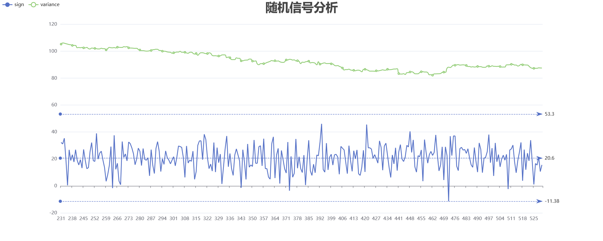

# 分布式随机信号分析系统

## 概述

- 使用nsq消息队列
- 借助echarts实现数据可视化

### 使用

启动服务后

访问 http://127.0.0.1:3000 查看可视化图表
访问 http://127.0.0.1:4171 打开nsq管理面板

注意：请确认相关端口(3000，4160，4161，4171)未被占用

### 示例说明



图中绿线为标准差，蓝线为随机信号，三条参考线从上至下依次为历史最大值，近期平均值 (300个数据之内)，历史最低值

#### 通过可执行文件启动 (win)

```
#解压 nsq-win.7z 压缩包
#进入nsq-1.2.1.windows-amd64.go1.16.6文件夹，在当前目录下，打开终端，运行 start.bat (.\start)
#通过Ctrl+Pause/Break退出程序
#注意：Ctrl+C 无法直接关闭程序
```

#### 在go环境下启动

```
# first
## 启动nsq
### https://nsq.io/overview/quick_start.html

# in one shell
nsqlookupd
# in another shell
nsqd --lookupd-tcp-address=127.0.0.1:4160
# in another shell
nsqadmin --lookupd-http-address=127.0.0.1:4161
```

```go
# 进入项目所在目录
# 启动相关模块
go run random/rand.go
go run mean/mean.go
go run variance/variance.go
go run maxAndmin/maxmin.go
go run chart/chart.go
```

### 流程

- 生产者 (rand.go) 向nsq发送topic为rand的消息
- 消费者 (若干数据处理单元，chart.go) 通过自己的channel分别向nsq订阅rand消息
- 数据处理单元 (mean，variance，maxmin) 在消费信息后，将统计量分别以新的topic (mean，variance，maxmin) 发布

- 可视化组件 (chart.go) ，订阅以上主题，数据封装为json格式
- 可视化组件作为服务器后端，监听3000端口，返回html页面
- 前端界面 (index.html) 通过websocket协议与后端通信，实现数据可视化 (echarts.js)

## 说明

相关组件的简要说明
### nsq

一个基于Go语言的分布式实时消息平台。

nsq 支持主题/订阅模式。

当生产者每次发布消息的时候,消息会采用多播的方式被拷贝到各个 channel 中。

channel 可在消费者之间进行负载均衡,消费者通过这个特殊的channel读取消息。若消费者想单独获取某个主题的消息时，需要订阅一个自己单独命名的channel以独占该channel上的消息。

nsq 主要包含三个工作进程：
- nsqd 接收、维护队列并发送消息到客户端
- nsqlookupd 管理拓扑信息，提供发现服务
- nsqadmin 提供了 Web UI 管理面板

### echarts

最初由百度开源的基于 JavaScript 的开源可视化图表库，后被捐赠给Apache基金会

ECharts 由数据驱动，数据的改变驱动图表展现的改变，所有数据的更新都通过 setOption实现，你只需要定时获取数据，setOption 填入数据，而不用考虑数据到底产生了那些变化，ECharts 会找到两组数据之间的差异然后通过合适的动画去表现数据的变化[2]。

## 设计

### mq/nsq.go

- 为使代码简洁，更具可读性，nsq.go封装了nsq客户端的创建与使用
- 代码中已经默认配置好了服务器地址，如使用提供的nsq服务器配置，初始化时，仅需为生产者提供需要订阅的主题以及channel名即可
- 通过sub函数为对应主题的消费者设置相应的消息处理函数
- 通过PubAsync/Pub，以异步/同步的方式发送消息
- 默认会创建一个生产者，若只希望订阅消息，可在初始化后关闭生产者
- 配置完成后，使用run函数，连接服务器

### 生产者 rand.go

- 为降低延时，如无特殊说明，本项目中的生产者均使用异步方式发送消息
- rand 发布 topic 为 rand 的消息
- rand 产生期望 a，标准差 b，服从正态分布的随机数 (a默认20，b默认10)
- 消息为 json 格式，接受消息后需要进行反序列化

### 数据处理单元

- 数据处理单元的基本模式是先作为消费者接受rand主题的消息，之后作为生产者将统计量以对应topic发布
- 接受消息，发送消息由不同协程 (goroutine) 并发执行，协程间通过管道 (channel) 进行同步
- 这里的 channel 为协程间通信方式与上文中和 topic 对应的 channel 不同

#### maxmin
- maxmin 发布 topic 为 maxmin 的消息
- 统计量 MaxAndMin，为历史最大值和历史最小值
- 最大值，最小值共用一个 topic

#### mean
- mean 发布 topic 为 mean 的消息
- 统计量 mean，为过去 n 个数据的平均值 (n默认300)
- 数据量不足 n 时，使用递推方式求解
- 数据量达到 n 后，使用移动均值公式计算
- 使用队列存储过去 n 个数据

#### variance
- variance 发布 topic 为 variance 的消息
- 统计量 variance，为过去 n 个数据的方差 (n默认300)
- 数据量不足 n 时，使用递推方式求解
- 数据量达到 n 后，使用移动/滚动方差公式计算[1]
- 使用队列存储过去 n 个数据

### 可视化组件 chart.go
- chart 初始化多个消费者，订阅 rand，maxmin，mean，variance 的消息
- 接受到的数据存储到 rowdata 结构体中，从该结构体可将数据转换 json 格式
- 为使代码简洁，chart.go中只保留服务器后端，接受消息移至analysis/chartUtility.go中，通过go包导入
- 服务器端提供了三个接口：
   - /，可视化图表
   - /data，查看 json 格式的数据
   - /ws，通过 websocket 协议实现实时数据通信，避免客户端轮询，发起大量http请求

## 致谢与尾声

本项目参考了fffzlfk大佬的相关代码[3]，没有前人的知识，我们无法走的更远。

项目早期基于java语言实现，使用activemq作为消息队列。完成数据处理部分后，由于没有心意的java绘图组件，我希望使用web ui 进行数据可视化，最初考虑使用spring框架，但spring框架对本项目来说似乎不是很轻量，考虑到使用go开发服务器端较为快捷高效，因此最后选择了使用go语言实现本项目，消息队列也换成了基于go的nsq。

## 附录
[1]: https://blog.csdn.net/u014250897/article/details/118466381
[2]: https://echarts.apache.org/handbook/zh/how-to/data/dynamic-data
[3]: https://github.com/fffzlfk